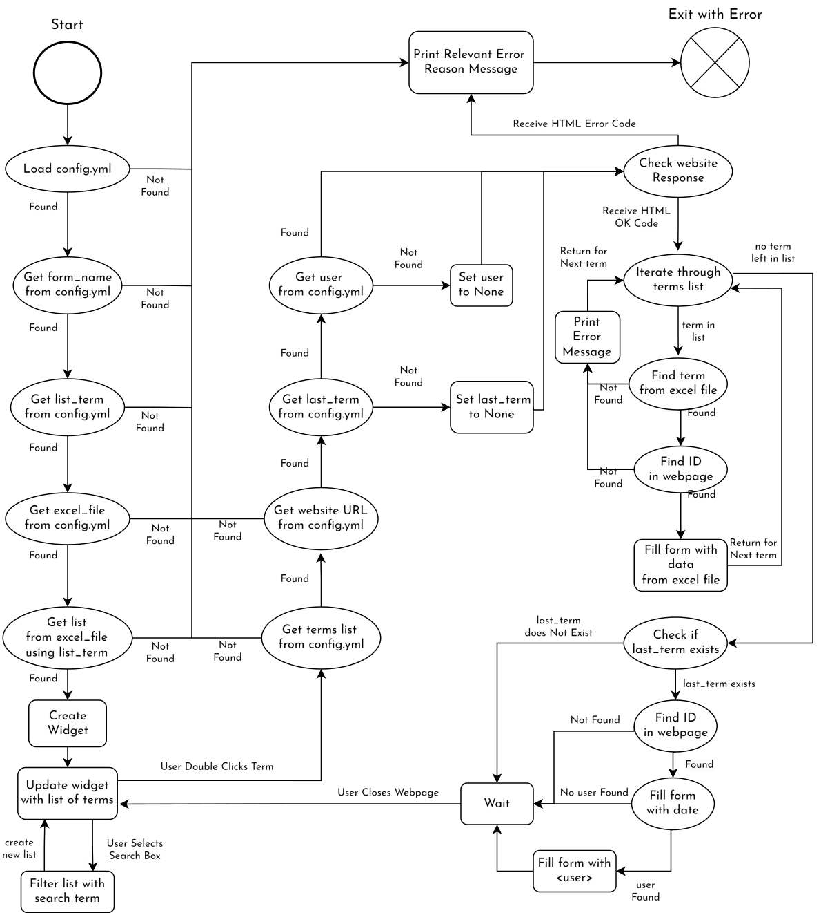

# A Form Filling Python Script

This python script takes in input from an excel file, creates a searchable list of terms, and automatically fills in a webpage. This Python script automates the process of filling out web forms by leveraging data from an Excel file.

- **Data Input**:
    - Reads input from an Excel file.
    - Creates a searchable list of terms.

- **Web Form Automation**:
    - Automatically fills in a webpage form using data from the Excel file.

- **Dynamic Configuration**:
    - Utilizes `config.yml` to specify terms and form fields.
    - Easily modify variables such as file names, website URLs, searchable terms, and user details.


## Installation Instructions

This script requires Python 3.x and several Python packages. The required packages are listed in the `requirements.txt` file. You can install these packages using pip:
```bash
pip  install  -r  requirements.txt
```
These  packages are:
- pandas
- PyYAML
- requests
- selenium

 
As  of  Selenium  4.6,  Selenium  automatically  downloads  the  correct  WebDriver  for  you. If you are having issues or are using an older version, refer to the [Selenium Documentation](https://www.selenium.dev/documentation/webdriver/troubleshooting/errors/driver_location/) for install the WebDriver.
## Usage Instructions

Before running the script, make sure you have configured the `config.yml` file to match your desired website and excel file.

-  The `config.yml` file is used to specify the website, excel file, terms and form boxes to fill. The key is the HTML id of the form input and the value is the excel header. Make sure these match exactly with your website and excel file as they are **case-sensitive**. See [configuration instructions](#Configuration-via-config.yml) for more detail.

- After configuring `config.yml` file, run the script in it's directory with:
 ```bash
 python form_filler.py
 ```

This will create a window with a searchable and scrollable list of terms from your excel file.

- **Select a term:** Browse or search through the list and double-click on a term. This will automatically fill out the form on the configured website using the information from the excel file corresponding to the selected term.

## Configuration via config.yml

  

`config.yml` allows for easier configurability for different website forms and excel sheets. The most important component is an unordered list of key-value pairs:

  
```
terms:
- 'first box id': 'First'
- 'second box id': 'Last'
```
  
Where the **key** is the **HTML id** of the form input and the **value** is the **excel header** of the corresponding column.

**Note:** The id and header are **case-sensitive**

This list can be **any** number of terms to enable compatibility with different forms and excel files. While it includes the `list_term` in my example, it's not a requirement.

### Other Configuration Terms
- `list_term` is the term used to create a searchable list, in my example it is Company Name.
- `form_name` and `website` are the excel file name and website URL, including the http(s):// prefix.
- `last_form` is an **optional** term to have a "final" form box to fill in additional information. It is the "notes" form in my example and fills in the date and the given `user`.
- `user` is another **optional** term which adds the user to the end of the `last_form` text.

  

The structure is in [yaml](https://en.wikipedia.org/wiki/YAML) format which means **order doesn't matter**, but white space **indentation does**.

### Sample Configuration
To find the headers of this excel file:


The excel headers are the top row, which would be:
- Company
- First
- Last
- Address

To find the HTML ids:
- Open the webpage with the form you want to fill out.
- Right-click on the form box you're interested in and select "Inspect" or "Inspect Element". This will open the Developer Tools pane, with the HTML for the selected form element highlighted.
- In the Developer Tools pane, look for the `id` attribute within the highlighted HTML tag. The value of the `id` attribute the value set in `config.yml`
- Repeat for other desired form boxes.

For example:


The id for the "Company" box is `company`.

The other ids are:
- `fname`
- `lname`
- `address`

So the `config.yml` terms would be:
```
terms:
- 'company': 'Company'
- 'fname': 'First'
- 'lname': 'Last'
- 'address': 'Address'
```

  

## Error handling and unit tests

I used pytests to test for proper handling of any issues in `config.yml`, the excel file, or the website itself. Simply run with `pytest` while in the main directory.

[test_read_config.py](/tests/test_read_config.py) test all the modules which handle loading in items from `config.yml` or the excel file.

- `test_load_config()` tests for a missing or empty config file.
- `test_get_config_value()` tests for elements not found in `config.yml`.
- `test_read_excel_fill()` tests for a missing excel file.
- `test_get_list()` tests that proper values are returned.

  

[test_read_row.py](/tests/test_read_row.py) tests that the proper row is returned. It creates a mock excel Dataframe and compares expected and returned values

  

[test_fill.py](/tests/test_fill.py) tests the primary fill function of the program. It creates a mock webpage and uses test files [test.xlsx](/tests/test.xlsx), [test.yml](/tests/test.yml), and [invalid.yml](/tests/invalid.yml)

- `test_fill()` tests a normal response and uses files [test.xlsx](/tests/test.xlsx) and [test.yml](/tests/test.yml) which can be easily modified for extended testing.

- `test_fill_invalid_config()` tests for when a value is not found in the excel file. This case does not close the program, so it tests if the output has a proper error message.

- `test_fill_invalid_website()` tests for when the website is not reachable, in this case a 404 error. This case also does not close the program, so it tests if the output has a proper error message.

## A Previous Version

This program was originally used for an internal RMA website form at a previous job for personal use, but has been modified to be more easily configurable. The original also had a small section to login into the website. This was achieved by getting the login credentials from the user, encrypting the credentials during storage, attempting to login, and checking if a certain HTML element was found to determine if the login was successful. It also stored the encrypted credentials for future usage, only checking during the initial use of the program. It also had a button to update the excel file and, for any customers not in the excel file, a button to fill out the form with some default information.

## The Test Website

I wrote an [ansible play](https://github.com/teddiursa/ansible_scripts/blob/main/roles/simple_website/tasks/main.yml) to create a [simple internal website](demo_files/form.html) for testing and demonstrations. While it does use a **FQDN** from my Nginx Reverse Proxy, this is unnecessary. 
 You can use its IP address instead by setting the `website` field in the `config.yml` file to the IP address.
 For example, I could instead set my example to
 ```
 website: 'http://192.168.0.84'
 ```


My test website's form boxes have aptly named ids, such as 'fname' for the first name input box, which is less common for public website forms. The terms list in `config.yml` should ease the configuration of these ids.

Since it uses the HTML ids to keep track of the form boxes, it should scale seamlessly with more complex websites.

## Flow Chart

